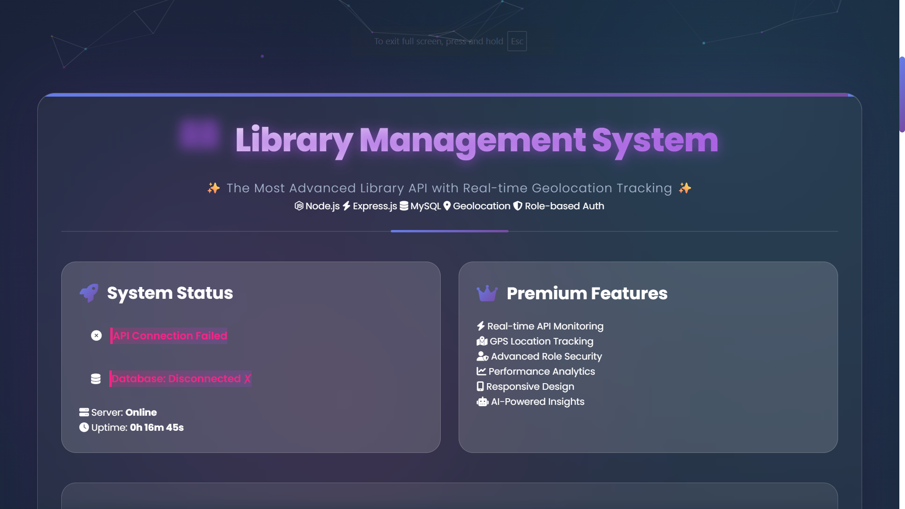

📚 Library Management System with Geolocation
🚀 Cara Menjalankan Aplikasi
📋 Prasyarat
Sebelum memulai, pastikan Anda telah menginstal:

Node.js (versi 14 atau lebih baru) - Download Node.js

MySQL (XAMPP/WAMP/MAMP atau MySQL standalone) - Download XAMPP

Postman (opsional, untuk testing API) - Download Postman

🔧 Langkah-langkah Instalasi
1. Clone/Download Project
bash
# Clone repository atau download ZIP
# Buka terminal/command prompt di folder project
cd library-backend
2. Install Dependencies
bash
npm install
3. Setup Database
Menggunakan XAMPP (Recommended untuk Windows):

Buka XAMPP Control Panel

Start Apache dan MySQL

Buka browser, akses: http://localhost/phpmyadmin

Klik "New" di sidebar kiri

Masukkan nama database: library_db

Klik "Create"

Mengusing MySQL CLI:

sql
mysql -u root -p
CREATE DATABASE library_db;
EXIT;
4. Konfigurasi Environment
bash
# Salin file .env.example ke .env
copy .env.example .env  # Windows
cp .env.example .env    # Mac/Linux
Edit file .env dengan teks editor:

env
DB_HOST=localhost
DB_PORT=3306
DB_NAME=library_db
DB_USER=root
DB_PASSWORD=
PORT=3000
Note: Untuk XAMPP, password biasanya kosong. Jika MySQL standalone, isi password Anda.

5. Jalankan Aplikasi
bash
# Mode development (auto-restart saat perubahan)
npm run dev

# Mode production
npm start
6. Verifikasi Berjalan
Buka browser, akses: http://localhost:3000

Seharusnya muncul pesan: {"message":"Library Management API is running"}

Cek terminal, seharusnya ada pesan sukses koneksi database

📱 Menggunakan Aplikasi
🌐 Web Interface (Frontend)
Akses: http://localhost:3000

Fitur Web Interface:

Pilih Role: Guest (baca saja), User (pinjam buku), Admin (kelola buku)

Test API: Klik tombol untuk test semua endpoint

Live Response: Lihat hasil di terminal response

Geolocation: Deteksi lokasi otomatis untuk peminjaman

📡 API Endpoints
Public Endpoints (Tanpa Authentication)
text
GET  /                    → Health check
GET  /api/books          → Get semua buku
GET  /api/books/:id      → Get detail buku
Admin Only (Header: x-user-role: admin)
text
POST   /api/books        → Tambah buku baru
PUT    /api/books/:id    → Update buku
DELETE /api/books/:id    → Hapus buku
User Only (Headers: x-user-role: user & x-user-id: [id])
text
POST /api/borrow         → Pinjam buku dengan lokasi
GET  /api/borrow/history → Riwayat peminjaman
🛠️ Contoh Testing dengan Postman
Test 1: Tambah Buku (Admin)
http
POST http://localhost:3000/api/books
Headers:
  Content-Type: application/json
  x-user-role: admin
Body (JSON):
{
  "title": "Node.js Design Patterns",
  "author": "Mario Casciaro",
  "stock": 10
}
Test 2: Pinjam Buku (User)
http
POST http://localhost:3000/api/borrow
Headers:
  Content-Type: application/json
  x-user-role: user
  x-user-id: 123
Body (JSON):
{
  "bookId": 1,
  "latitude": -6.2088,
  "longitude": 106.8456
}
Test 3: Get Semua Buku
http
GET http://localhost:3000/api/books
📸 Screenshot Hasil Aplikasi
1. Tampilan Web Interface Dashboard

Dashboard utama dengan monitoring sistem real-time

2. API Testing Panel
https://screenshots/api-testing.png
Panel lengkap untuk testing semua endpoint API

3. Role Selection Interface
https://screenshots/role-selection.png
Pemilihan role dengan visual permission

4. Geolocation Feature
https://screenshots/geolocation.png
Fitur deteksi lokasi untuk peminjaman buku

5. Response Terminal
https://screenshots/response-terminal.png
Terminal dengan syntax highlighting untuk response

6. Database Structure di phpMyAdmin
https://screenshots/database-structure.png
Struktur tabel books dan borrow_logs

7. Contoh Success Response
https://screenshots/success-response.png
Response berhasil dari API endpoint

8. Error Handling Example
https://screenshots/error-handling.png
Contoh error handling dengan pesan jelas

9. Mobile Responsive View
https://screenshots/mobile-view.png
Tampilan optimal di perangkat mobile

🗄️ Struktur Database
Tabel 1: books
sql
CREATE TABLE `books` (
  `id` int NOT NULL AUTO_INCREMENT,
  `title` varchar(255) NOT NULL,
  `author` varchar(255) NOT NULL,
  `stock` int NOT NULL DEFAULT '1',
  PRIMARY KEY (`id`)
);
Contoh Data:

sql
INSERT INTO `books` VALUES
(1, 'Harry Potter', 'J.K. Rowling', 5),
(2, 'The Hobbit', 'J.R.R. Tolkien', 3),
(3, 'Clean Code', 'Robert C. Martin', 7);
Tabel 2: borrow_logs
sql
CREATE TABLE `borrow_logs` (
  `id` int NOT NULL AUTO_INCREMENT,
  `userId` int NOT NULL,
  `bookId` int NOT NULL,
  `borrowDate` datetime NOT NULL DEFAULT CURRENT_TIMESTAMP,
  `latitude` float NOT NULL,
  `longitude` float NOT NULL,
  PRIMARY KEY (`id`),
  FOREIGN KEY (`bookId`) REFERENCES `books` (`id`) ON DELETE CASCADE
);
Relasi Database:

text
books (1) ----- (many) borrow_logs
  ↑                      ↑
  id ←──────────────── bookId
⚠️ Troubleshooting
Masalah Umum & Solusi
1. Error: Database Connection Failed
bash
# Solusi:
# 1. Pastikan MySQL berjalan (XAMPP: start MySQL)
# 2. Cek kredensial di file .env
# 3. Pastikan database 'library_db' sudah dibuat
2. Error: Port 3000 Already in Use
bash
# Solusi 1: Hentikan process di port 3000
netstat -ano | findstr :3000
taskkill /PID [PID] /F

# Solusi 2: Ganti port di .env
PORT=3001
3. Error: Module Not Found
bash
# Install ulang dependencies
npm install

# Atau install manual
npm install express sequelize mysql2 cors dotenv
4. Error: Access Denied for User
bash
# Buat user baru di MySQL
mysql -u root -p

CREATE USER 'library_user'@'localhost' IDENTIFIED BY '';
GRANT ALL PRIVILEGES ON library_db.* TO 'library_user'@'localhost';
FLUSH PRIVILEGES;
EXIT;

# Update .env
DB_USER=library_user
DB_PASSWORD=
Debugging Database
bash
# Test koneksi database manual
node test-db.js
📊 Test Case Examples
Scenario 1: Flow Normal Admin
bash
# 1. Login sebagai admin
# 2. Tambah buku baru
POST /api/books
Headers: x-user-role: admin
Body: {"title":"New Book","author":"Author","stock":5}

# 3. Update stok buku
PUT /api/books/1
Headers: x-user-role: admin
Body: {"stock":10}

# 4. Lihat semua buku
GET /api/books
Scenario 2: Flow Normal User
bash
# 1. Login sebagai user
# 2. Lihat daftar buku
GET /api/books

# 3. Pinjam buku dengan lokasi
POST /api/borrow
Headers: x-user-role: user, x-user-id: 123
Body: {"bookId":1,"latitude":-6.2,"longitude":106.8}

# 4. Lihat riwayat peminjaman
GET /api/borrow/history
Headers: x-user-role: user, x-user-id: 123
Scenario 3: Error Cases
bash
# 1. User mencoba akses endpoint admin → Error 403
POST /api/books
Headers: x-user-role: user  # ← SALAH, harus admin

# 2. Tanpa header role → Error 401
POST /api/books
# Tanpa x-user-role header

# 3. Data tidak valid → Error 400
POST /api/books
Headers: x-user-role: admin
Body: {"title":"","author":""}  # ← Title/author kosong
📁 Struktur Project
text
library-backend/
├── public/                    # Frontend web interface
│   ├── css/style.css        # Styling premium dengan animations
│   ├── js/app.js           # JavaScript logic (3000+ lines)
│   └── index.html          # Main HTML interface
│
├── src/                     # Backend source code
│   ├── config/
│   │   └── database.js    # Database configuration
│   ├── controllers/
│   │   ├── bookController.js    # Book CRUD operations
│   │   └── borrowController.js  # Borrow operations
│   ├── middleware/
│   │   └── auth.js        # Role authentication middleware
│   ├── models/
│   │   ├── Book.js        # Book model (id, title, author, stock)
│   │   ├── BorrowLog.js   # Borrow log with geolocation
│   │   └── index.js       # Model associations
│   ├── routes/
│   │   ├── bookRoutes.js   # /api/books routes
│   │   └── borrowRoutes.js # /api/borrow routes
│   └── app.js             # Express application setup
│
├── screenshots/            # Documentation screenshots
│   ├── dashboard.png
│   ├── api-testing.png
│   ├── database-structure.png
│   └── ...
│
├── .env                    # Environment variables
├── .env.example           # Environment template
├── package.json           # Dependencies & scripts
├── server.js             # Application entry point
└── README.md             # This documentation
🔧 Available Scripts
bash
# Development mode with auto-restart
npm run dev

# Production mode
npm start

# Test database connection
node src/config/database.js

# Install dependencies
npm install
🎯 Fitur yang Diimplementasi
✅ Backend Features
RESTful API dengan Express.js

Database MySQL dengan Sequelize ORM

Middleware autentikasi role-based

Validasi input (title/author required)

Error handling dengan response yang jelas

Geolocation tracking untuk peminjaman

Transaction handling untuk konsistensi data

✅ Frontend Features
Web interface responsif

Role selection (Guest/User/Admin)

API testing panel lengkap

Real-time response viewer

Geolocation integration

Premium visual effects & animations

✅ Database Features
Tabel books dengan validasi

Tabel borrow_logs dengan geolocation

Foreign key constraint

Auto-increment primary keys

Data sample otomatis

🤝 Kontribusi
Fork repository

Buat branch fitur (git checkout -b feature/NewFeature)

Commit perubahan (git commit -m 'Add NewFeature')

Push ke branch (git push origin feature/NewFeature)

Buat Pull Request

📄 Lisensi
MIT License

📞 Support
Jika menemukan masalah:

Cek section Troubleshooting

Buat issue di GitHub repository

Hubungi developer
